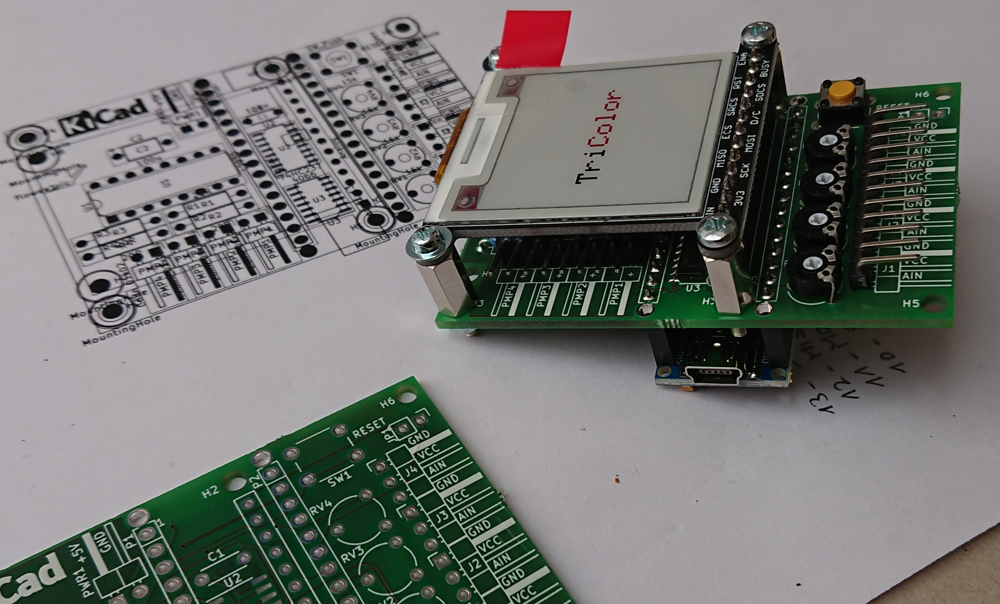
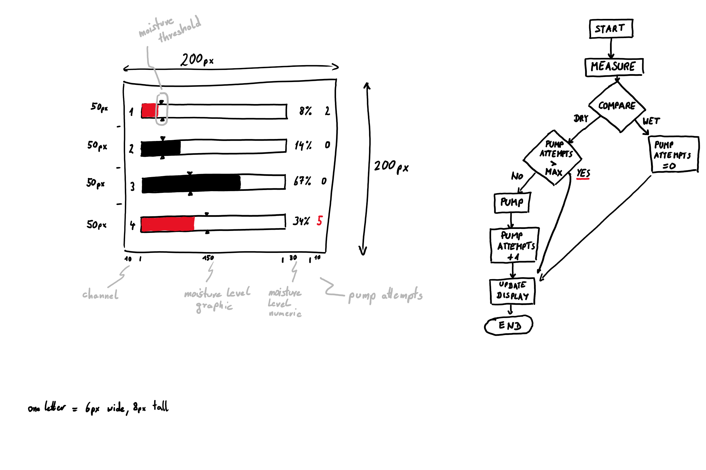

# Soil Moisture Guard

an electronic project to automatically water up to 4 plants

uses
- 1x [Arduino Nano](https://www.arduino.cc/en/pmwiki.php?n=Main/ArduinoBoardNano)
- 1x [Adafruit eInk Display](https://learn.adafruit.com/adafruit-1-54-eink-display-breakouts)
- 4x [Adafruit pumps](https://www.adafruit.com/product/4547)
- 4x [capacitive soil moisture sensors](https://wiki.dfrobot.com/Capacitive_Soil_Moisture_Sensor_SKU_SEN0193)

## Links

- capacitive sensor - https://makersportal.com/shop/capacitive-soil-moisture-sensor
- schematic - https://thecavepearlproject.org/2020/10/27/hacking-a-capacitive-soil-moisture-sensor-for-frequency-output/
- https://learn.adafruit.com/adafruit-stemma-soil-sensor-i2c-capacitive-moisture-sensor
